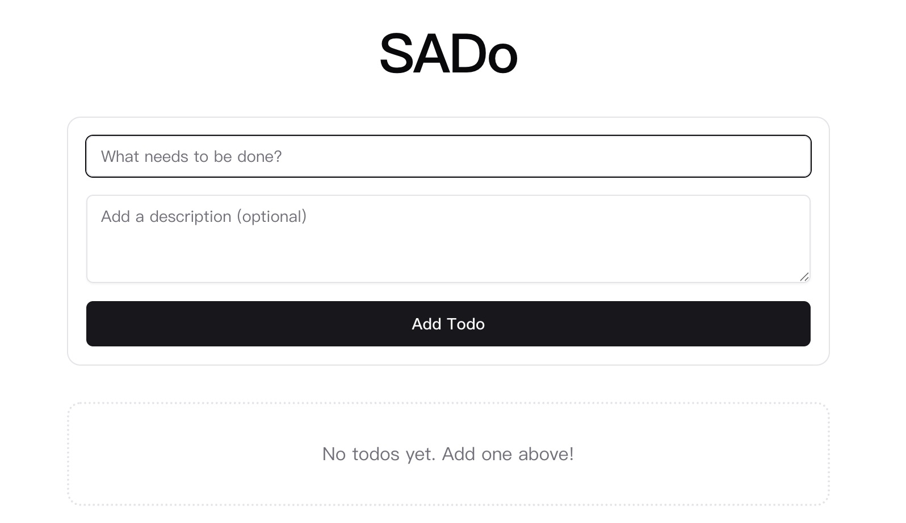

# SADo - Simple Todo App

This is a monorepo for the SADo (Simple Todo) application, built as an example project for SAD (System Analysis and Design). It includes a Next.js frontend and an Express.js backend.



## Tech Stack

*   **Monorepo:** [pnpm](https://pnpm.io/) workspaces + [Turborepo](https://turbo.build/repo)
*   **Frontend:** [Next.js](https://nextjs.org/), [React](https://react.dev/), [TypeScript](https://www.typescriptlang.org/), [Tailwind CSS](https://tailwindcss.com/), [Shadcn UI](https://ui.shadcn.com/) (via [`@workspace/ui`](packages/ui/package.json))
*   **Backend:** [Node.js](https://nodejs.org/), [Express.js](https://expressjs.com/), [TypeScript](https://www.typescriptlang.org/), [MongoDB](https://www.mongodb.com/) with [Mongoose](https://mongoosejs.com/)
*   **Linting/Formatting:** [ESLint](https://eslint.org/) (via [`@workspace/eslint-config`](packages/eslint-config/package.json)), [Prettier](https://prettier.io/)
*   **Testing (Frontend):** [Playwright](https://playwright.dev/), [Jest](https://jestjs.io/)

    

 


## Project Structure

*   `apps/frontend`: Contains the Next.js frontend application.
*   `apps/backend`: Contains the Express.js backend application.
*   `packages/ui`: Shared React UI components based on Shadcn UI.
*   `packages/eslint-config`: Shared ESLint configurations.
*   `packages/typescript-config`: Shared TypeScript configurations.

## Getting Started

### Prerequisites

*   Node.js (v20 or higher - see root [`package.json`](package.json))
*   pnpm (v9.12.3 or compatible - see root [`package.json`](package.json))
*   MongoDB instance (running locally or accessible via connection string)

### Installation

1.  Clone the repository.
2.  Install dependencies from the root directory:
    ```bash
    pnpm install
    ```
3.  Set up environment variables:
    *   Copy `.env.example` to `.env` in `apps/backend` and configure your `MONGODB_URI`.
    *   (Optional) Configure frontend environment variables if needed.

### Running the Development Servers

To start both the frontend and backend development servers concurrently:

```bash
pnpm dev
```

This uses Turborepo to run the `dev` script defined in package.json and package.json.

*   Frontend will be available at `http://localhost:3000` (or the next available port).
*   Backend will be available at `http://localhost:5000` (or the port specified in your backend config/env).

## Available Scripts

Run these commands from the root directory:

*   `pnpm build`: Build both frontend and backend applications.
*   `pnpm start`: Start the production builds of both applications (requires building first).
*   `pnpm dev`: Start development servers for frontend and backend.
*   `pnpm lint`: Lint all code in the monorepo.
*   `pnpm format`: Format all code using Prettier.
*   `pnpm test`: Run unit tests (currently configured for the frontend using Jest).
*   `pnpm test:e2e`: Run end-to-end tests (currently configured for the frontend using Playwright).

You can also run scripts for individual workspaces, e.g., `pnpm --filter backend dev`.

## test change
